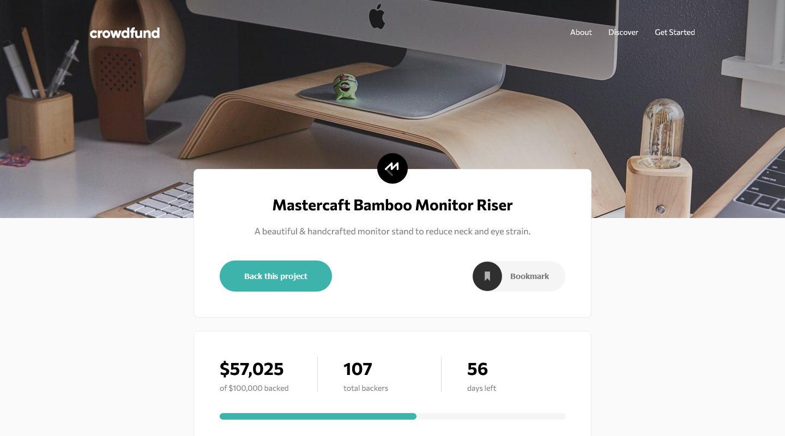

# Crowdfunding Product Page

## Challenge
Users of this page should be able to:
- View the optimal layout depending on their device's screen size
- See hover states for interactive elements
- Make a selection of which pledge to make
- See an updated progress bar and total money raised based on their pledge total after confirming a pledge
- See the number of total backers increment by one after confirming a pledge
- Toggle whether or not the product is bookmarked

### Links

- [Solution]()
- [Live Site](https://resilient-bubblegum-2df172.netlify.app)

### Built with

- React JS & JSX
- React-Redux
- Flexbox
- CSS Grid
- CSS custom properties
- Desktop-first workflow

## Author

- Frontend Mentor [@Isaiah-B](https://www.frontendmentor.io/profile/Isaiah-B)
